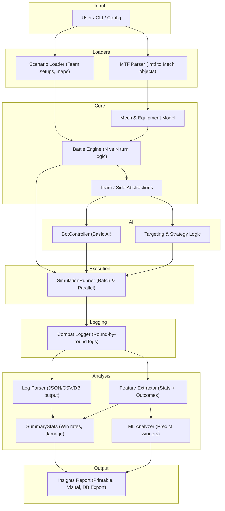

# BattleTechSim Design Document

This document is currently being rebuilt.

We will iterate through all sections to ensure that it accurately reflects the current architecture, reasoning, and
planned features of the BattleTechSim project.

---

## Overview

**BattleTechSim** is a scalable and modular simulation framework for resolving BattleMech combat under the rules of the
BattleMech Manual (BMM). Its purpose is to simulate individual and team-based mech engagements using real unit data from
`.mtf` files, produce detailed combat logs, and support downstream analysis and machine learning to identify trends in
performance, cost-effectiveness, and tactical outcomes.

---

## Goals

BattleTechSim is designed to achieve the following:

- **Faithful simulation of BMM rules** for mech combat, starting with 1v1 on a flat map and expanding to team battles.
- **Scalable simulation execution**, including batch runs and eventual parallel processing of thousands of matches.
- **Structured combat logging** for replay, debugging, and machine learning analysis.
- **Modular architecture** to support rule toggling, custom equipment, and alternate rulebooks.
- **Data extraction and ML support** to identify mech performance trends, balance issues, and value metrics.
- **Extensibility** to support future GUI, web API access, AI opponents, and additional unit types.

---

## System Modules

### 1. MTF Parser

Parses `.mtf` files and converts them into in-memory `Mech` objects. This parser extracts all relevant stats: tonnage,
speed, heat sinks, armor, internal structure, and weapon loadout. It is built to support the entire known set of
\~4,000+ variants, with minimal assumptions and maximum compatibility.

> **Future support:** parsing special equipment and rare weapon types, as well as caching or batch loading into a DB or
> intermediate format.

### 2. Scenario Loader

Defines match configurations: number of teams, mech assignments, and map parameters. In early versions, this will be
basic (flat open terrain, fixed pilot skill). Later, it will support predefined scenarios, randomized team selection,
and user-supplied configs.

> **Future support:** scenario scripting, difficulty scaling, and dynamic rulesets.

### 3. Domain Model

Encapsulates core entities used throughout the simulation:

- `Mech`: stats, status, weapons, heat
- `Weapon`: damage, type, firing modes
- `Team`: one or more Mechs sharing initiative context
- `Pilot`: static skill for now, future variability planned
- `Battle`: container for a match in progress

This layer serves as the foundation for simulation and logging logic.

### 4. Simulation Engine

Manages the flow of combat via a turn-based engine:

- Initiative
- Movement
- Weapon declaration and resolution
- Heat tracking
- Damage and critical hits
- Mech status (shutdowns, destruction, etc.)

Designed for N vs N matchups from the start, with modular handling of each phase. Eventually, optional rules and
equipment behaviors will plug into this engine cleanly.

### 5. BotController

Controls AI behavior in lieu of a human player. Early versions will make basic legal decisions (e.g., move and fire all
weapons). Future versions will incorporate tactical logic like range management, heat control, focus fire, and optional
ML agents.

### 6. Combat Logger

Captures all actions during simulation in a structured format:

- Per-round action sequences
- Mech states before and after each action
- Outcomes of attacks, shutdowns, destruction

This is essential for debugging, replaying, analysis, and ML.

### 7. SimulationRunner

Coordinates batch and parallel execution of matches. It can:

- Load large matchup sets (e.g., round-robin)
- Use deterministic seeds for reproducibility
- Run simulations in parallel threads or future distributed systems

---

## Logging & Analysis

### Combat Logger

All simulated battles are recorded through a structured logging system. The logger tracks:

- Turn-by-turn actions
- Movement, attacks, and special effects
- Damage, heat, shutdowns, destruction
- Per-mech state transitions (armor, internals, heat levels)

Each battle log is written as a **JSON object**, with the option to export or convert to **CSV**, **JSONL**, or database
entries later.

> This design prioritizes auditability, replay support, and postprocessing for ML.

### Log Format Philosophy

The logs are designed to be:

- **Human-readable**, for debugging and review
- **Machine-parsable**, for feature extraction and ML model training
- **Extensible**, to support new phases or rule variants

They serve as the source of truth for:

- Statistical summaries
- Mech/weapon performance reports
- Training data for outcome prediction or mech ranking models

### Feature Extraction

Raw logs are parsed into structured **feature vectors**, where each vector represents:

- A single battle outcome
- A single mechs role and result
- A weapons observed behavior

Features include:

- Tonnage, movement, firepower
- Heat efficiency, survivability, accuracy
- Win/loss, turns survived, damage dealt

### Statistical Reporting

Simple statistics are generated post-battle or in batch:

- Win rates per mech, per weight class
- Average damage output and accuracy
- Efficiency metrics (damage per BV, etc.)

These reports may be exported for external analysis or viewed via CLI/UI.

### ML Readiness

The entire logging system feeds into the machine learning pipeline. Logs become:

- Feature datasets (CSV, JSONL)
- Ground truth for training models
- Inputs for future smart AI or mech evaluation

---

## Extensibility Plan

BattleTechSim is being designed from the ground up to support long-term growth, experimentation, and modular replacement
of subsystems. Key areas of extensibility include:

### Static Analysis Guardrails

- When package boundaries are formalized, enable PMD's `LoosePackageCoupling` rule with a defined allowlist.
- Until the module boundaries are stable, keep the rule disabled to avoid false positives and churn.

### 1. Rule Variants & Rulebook Swapping

- The simulation engine supports toggling or replacing rule modules (e.g., movement, targeting, heat).
- Alternate rulebooks such as *Total Warfare* or custom rule sets can be added as pluggable implementations.
- Optional rules (e.g., torso twist, physical attack modifiers) are handled via configuration or strategy objects.

### 2. Weapon and Equipment Behavior

- Weapons and special systems are treated as modular behavior units.
- Future weapons with custom effects (e.g., stealth, ECM, TSM, AMS) will plug into shared event systems or hook points
  in the engine.
- Design favors composition over inheritance to avoid tight coupling.

### 3. AI and Bot Controllers

- AI is abstracted behind a `Controller` interface.
- You can inject simple scripts, tactical evaluators, or even ML-backed decision makers without touching the core sim.
- Future: shared memory or battle context system for team coordination logic.

### 4. Combat Logging and Output

- Log structure is versioned and designed to support new action types and phases without breaking old parsers.
- Output formats can be switched from JSON to CSV, JSONL, or eventually streamed to a database or web service.

### 5. Parallelization and Distribution

- The simulation runner can batch simulations across threads or jobs.
- Logs are written incrementally and safely, with optional deterministic seeding.
- Design is friendly to future distributed simulations across nodes or servers.

### 6. UI, API, and Visualization

- CLI remains the initial control interface, but hooks exist for future GUI visualizers or REST APIs.
- Future integrations may include match viewers, simulation dashboards, or mech configuration UIs.

---

## Architecture Diagram Reference

BattleTechSims modular architecture is visualized using a Mermaid diagram. It illustrates the flow of data and
responsibilities between each major subsystem:



---

## Example Log Format

The following is a simplified example of the JSON structure used for a single 1v1 battle:

```json
{
  "battle_id": "00123",
  "mech_a": "Wolverine WVR-6R",
  "mech_b": "Panther PNT-9R",
  "rounds": [
    {
      "round": 1,
      "turns": [
        {
          "actor": "Wolverine WVR-6R",
          "action": "move",
          "movement": "walk 5 hexes"
        },
        {
          "actor": "Panther PNT-9R",
          "action": "move",
          "movement": "jump 3 hexes"
        },
        {
          "actor": "Wolverine WVR-6R",
          "action": "fire",
          "weapon": "AC/5",
          "target": "Panther PNT-9R",
          "hit": true,
          "damage": 5
        },
        {
          "actor": "Panther PNT-9R",
          "action": "fire",
          "weapon": "PPC",
          "target": "Wolverine WVR-6R",
          "hit": false
        }
      ]
    }
  ],
  "outcome": {
    "winner": "Wolverine WVR-6R",
    "turns": 6
  }
}
```

This log is designed to be parsed both by machines and reviewed by humans. It supports versioning and future
extensibility (e.g., team battles, custom actions, pilot traits).

---

## Future Work

The prototype will focus on essential mechanics and structured logging, but the long-term roadmap includes:

### Simulation Capabilities

- Support for multi-team battles (e.g., 4v4v4)
- Configurable terrain and elevation maps
- Simultaneous battles via distributed scheduling

### AI Improvements

- Tactical behavior trees (e.g., prioritize rear shots, avoid shutdown)
- Shared memory/team coordination
- ML-driven decision making with reinforcement or supervised learning

### Rule Expansion

- Support for special equipment (e.g., stealth, C3, ECM, TSM)
- Optional and advanced rules from Total Warfare and other supplements
- Custom rule modules for alternate game variants

### Data Infrastructure

- Log compression and database indexing
- Cloud storage and querying of combat results
- Web dashboard for battle review and mech performance analytics

### Interfaces

- GUI battle visualizer
- Web-based simulation API
- Mech editor and configuration UI

### Machine Learning Extensions

- Model training and evaluation tools (e.g., winner prediction, heat efficiency)
- Feature visualization and importance tracking
- Mech optimizer or recommender based on user input


